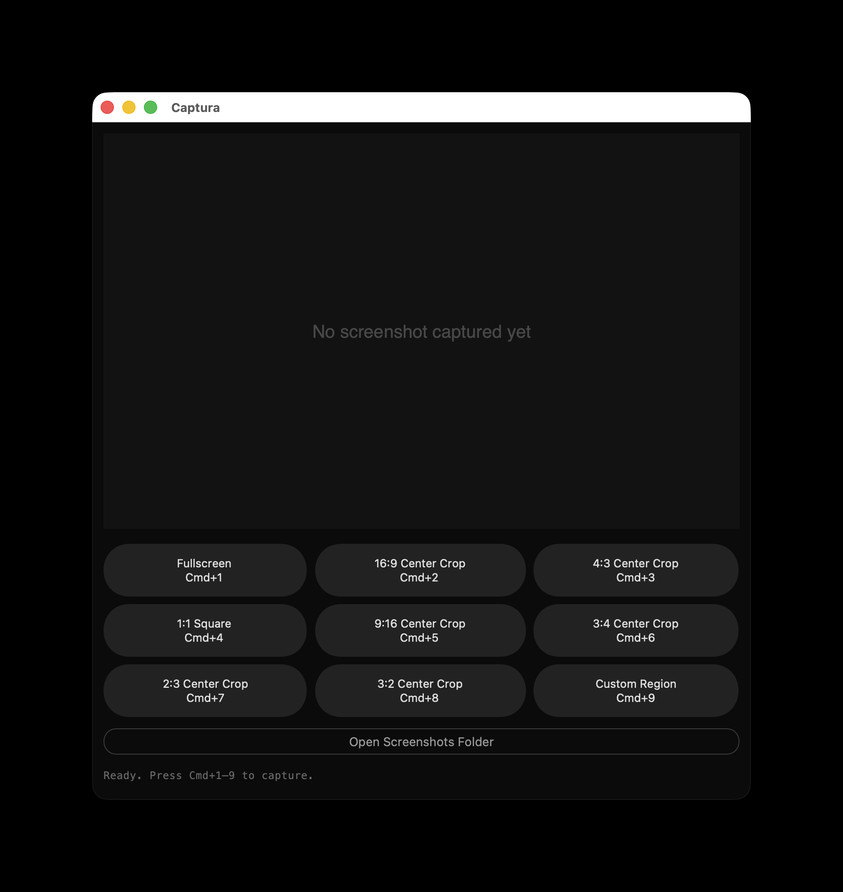
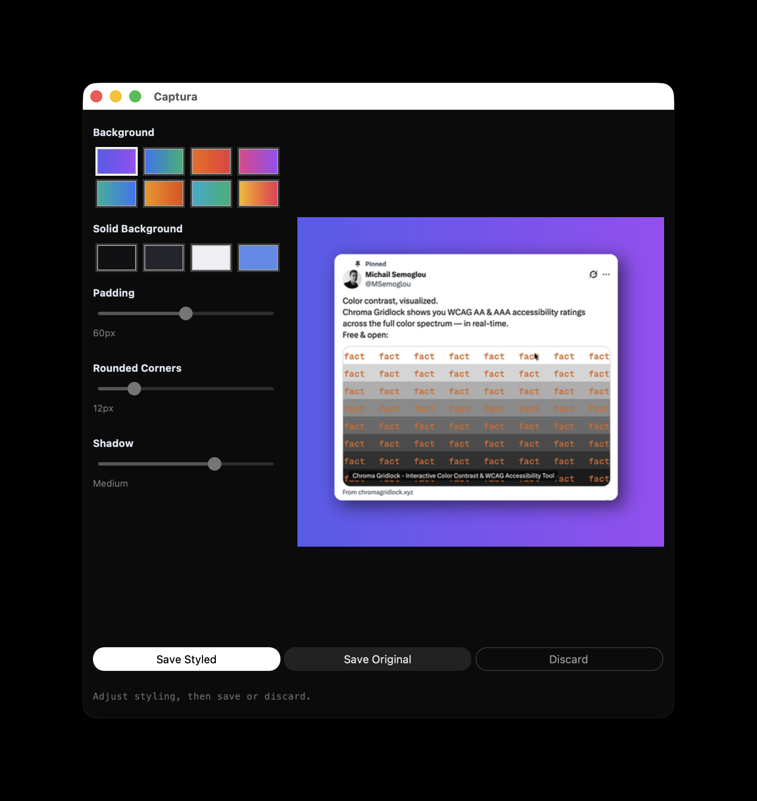

# Captura

A lightweight Python desktop application for macOS that captures, previews, and
auto-saves screenshots with a single click or keyboard shortcut. After each
capture, a built-in **styling panel** lets you add a styled background, padding,
rounded corners, and a drop shadow before saving — no cloud dependency, no
telemetry.




---

## Requirements

| Requirement | Version              |
| ----------- | -------------------- |
| macOS       | 12 Monterey or later |
| Python      | 3.11 or later        |

> **macOS System Python note**: The system Python stub at `/usr/bin/python3` on
> macOS 12+ is not a full Python installation. Install Python via
> [Homebrew](https://brew.sh) (`brew install python@3.11`) or
> [pyenv](https://github.com/pyenv/pyenv) and confirm with `which python3`.

---

## Setup

```bash
# 1. Clone the repository
git clone <repository-url>
cd captura

# 2. Create and activate a virtual environment
python3 -m venv .venv
source .venv/bin/activate

# 3. Install runtime dependencies
pip install -r requirements.txt

# 4. Verify the installation
python -c "import customtkinter, mss, PIL; print('All dependencies installed.')"
```

---

## Running the App

```bash
source .venv/bin/activate
python main.py
```

The application window opens immediately. On first launch, macOS may prompt for
**Screen Recording** permission — see the [Permissions](#macos-screen-recording-permission)
section below.

---

## Capture Modes

| Shortcut  | Mode               |
| --------- | ------------------ |
| **Cmd+1** | Fullscreen         |
| **Cmd+2** | 16:9 center crop   |
| **Cmd+3** | 4:3 center crop    |
| **Cmd+4** | 1:1 square         |
| **Cmd+5** | 9:16 center crop   |
| **Cmd+6** | 3:4 center crop    |
| **Cmd+7** | 2:3 center crop    |
| **Cmd+8** | 3:2 center crop    |
| **Cmd+9** | Custom region drag |

Shortcuts are active whenever the Captura window has keyboard
focus. All modes are also accessible via the 3×3 button grid in the app.

For **Cmd+9** (custom region): a full-screen overlay appears — click and drag
to draw the capture rectangle, then press **Enter** to confirm or **Escape** to
cancel.

---

## Styling Panel

After every capture, a built-in **styling panel** replaces the capture view
before anything is saved. It lets you:

- Choose a **gradient** background (8 presets) or a **solid colour** (4 presets)
- Adjust **padding** (0–120 px) between the screenshot and the background edge
- Set **rounded corners** (0–60 px radius) on the screenshot
- Pick a **shadow** size: None / Small / Medium / Large

A live preview updates as you adjust the controls. Three buttons let you finish:

| Button            | Action                                        |
| ----------------- | --------------------------------------------- |
| **Save Styled**   | Apply all effects at full resolution and save |
| **Save Original** | Save the raw screenshot without any effects   |
| **Discard**       | Discard the capture without saving            |

---

## Captured Files

All screenshots are saved automatically to:

```
~/Screenshots/screenshot_YYYY-MM-DD_HH-MM-SS_<mode>.png
```

Example: `~/Screenshots/screenshot_2026-04-05_14-30-45_fullscreen.png`

The folder is created automatically on first capture. Use the
**"Open Screenshots Folder"** button in the app to open it in Finder.

---

## macOS Screen Recording Permission

macOS 10.15 Catalina and later require explicit **Screen Recording** permission
for any third-party app that captures screen content programmatically.

**If you see a permission dialog on first launch:**

1. Click **"Open Privacy Settings"** in the dialog.
2. macOS opens `System Settings → Privacy & Security → Screen Recording`.
3. Toggle the switch next to **Captura** to enable it.
4. Quit and relaunch the app.

Without this permission, captures will produce a black image. The app detects
this automatically and will prompt you with the steps above.

---

## Development

### Installing dev dependencies

```bash
pip install -r requirements-dev.txt
```

### Running Tests

```bash
# Run the full test suite
pytest

# Run with coverage report
pytest --cov=capture --cov=storage --cov=preview --cov=platform_utils \
       --cov=beautify --cov-report=term-missing

# Run a single test file
pytest tests/test_beautify.py -v
```

### Linting

```bash
ruff check .
```

All pull requests must pass `ruff check .` with zero violations before merge.

### Building a Distributable .app

```bash
pip install "pyinstaller>=6.6.0"
pyinstaller captura.spec --noconfirm
# Output: dist/Captura.app
```

---

## Project Structure

```
captura/
├── main.py                 # Launcher (python main.py)
├── app.py                  # GUI entry point, window controller, styling panel
├── beautify.py             # Background, padding, shadow, rounded-corner effects
├── capture.py              # Screen capture logic (9 modes)
├── storage.py              # Filename generation, folder creation, file save
├── platform_utils.py       # macOS permissions, Finder integration
├── shortcuts.py            # Cmd+1–9 keyboard shortcut registration
├── preview.py              # Image resize utility for the preview canvas
├── requirements.txt        # Runtime dependencies
├── requirements-dev.txt    # Dev + test dependencies
├── pyproject.toml          # Project metadata, ruff + pytest config
├── README.md               # This file
└── tests/
    ├── test_capture.py
    ├── test_storage.py
    ├── test_preview.py
    ├── test_platform_utils.py
    └── test_beautify.py
```

---

## Design Notes

- **Window hiding before capture**: The app window is withdrawn 200 ms before
  `mss.grab()` runs so it never appears in screenshots. It is restored once the
  styling panel appears.
- **Custom region window hiding**: For Cmd+9, the main window is made invisible
  via `attributes("-alpha", 0.0)` rather than `withdraw()`. This keeps the app
  as the active macOS process so the `overrideredirect` overlay can still receive
  Return/Escape key events via `focus_force()`. A 150 ms delay gives macOS time
  to repaint a clean screen before the overlay takes its background screenshot.
  Alpha is restored to `1.0` on cancel or after the capture completes.
- **HiDPI / Retina scale detection**: Scale is derived from
  `mss_physical_width / tkinter_logical_width` rather than DPI arithmetic, which
  is accurate on both Retina and non-Retina displays.
- **Privacy**: The app never sends data over a network. All images are stored
  locally in `~/Screenshots/`.

---

## Contributing

Bug reports and pull requests are welcome on
[GitHub](https://github.com/MichailSemoglou/captura). Please open an issue before
submitting large changes.

---

## License

This project is licensed under the [MIT License](LICENSE).
